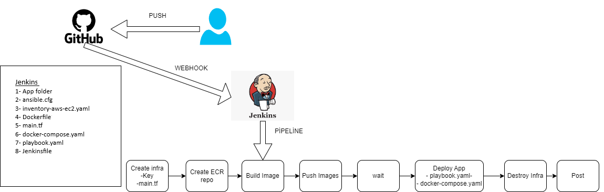

## 📸 Architecture Diagram



# Jenkins-Based CI/CD Project: Docker Compose Deployment on AWS

This project demonstrates a complete CI/CD pipeline that automates the provisioning, configuration, containerization, and deployment of a Docker-based application on AWS EC2 using **Terraform**, **Ansible**, **Docker Compose**, and **Jenkins**.

---

## 📌 Project Structure

```text
Jenkins-Project/
├── app/                        # Application source code (frontend/backend)
├── ansible.cfg                 # Ansible configuration file
├── inventory-aws-ec2.yaml      # Ansible inventory for the AWS EC2 instance
├── Dockerfile                  # Dockerfile for building application image
├── docker-compose.yaml         # Docker Compose file for multi-service app
├── main.tf                     # Terraform file to provision EC2 instance
├── playbook.yaml               # Ansible playbook to install Docker, Compose, etc.
└── Jenkinsfile                 # Jenkins pipeline definition
```

---

## ⚙️ Tools Used

- **Terraform**: Provisions AWS EC2 infrastructure.
- **Ansible**: Configures EC2 instance with Docker, Docker Compose, etc.
- **Docker & Docker Compose**: Containerize and run multi-service app.
- **Jenkins**: Orchestrates the CI/CD pipeline.
- **AWS EC2 & ECR**: Hosts and stores Docker images.

---

## 🚀 CI/CD Pipeline Overview

The pipeline is triggered automatically via a **GitHub webhook** when changes are pushed to the repository.

```text
1. Create Infra        → Using Terraform (main.tf)
2. Create ECR Repo     → To store Docker image
3. Build Image         → From Dockerfile
4. Push Image          → To AWS ECR
5. Wait                → For EC2 readiness
6. Deploy App          → Via Ansible (playbook.yaml) + Docker Compose
7. Destroy Infra       → Tear down EC2 after deployment
8. Post                → Final steps (e.g., notification/logging)
```

---

## 📦 Application

- The application source code is placed under the `app/` folder.
- Dockerfile and docker-compose.yaml are used to containerize and run the app.
- The app is deployed to the EC2 instance via Ansible and Docker Compose.

---

## ✅ Output

- A fully automated pipeline that handles provisioning, Docker image creation, ECR push, deployment, and teardown.
- Demonstrates end-to-end CI/CD using Jenkins for real-world Dockerized application delivery on AWS.

---

